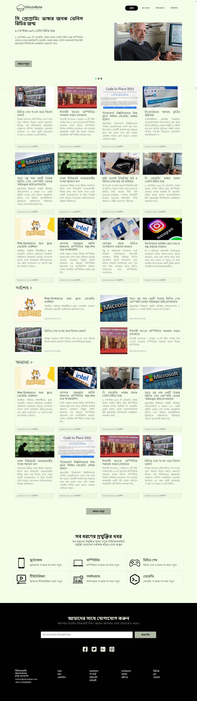
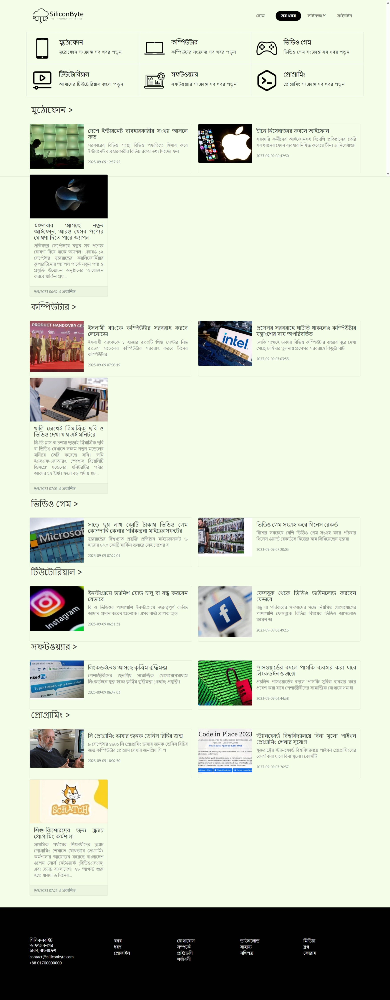
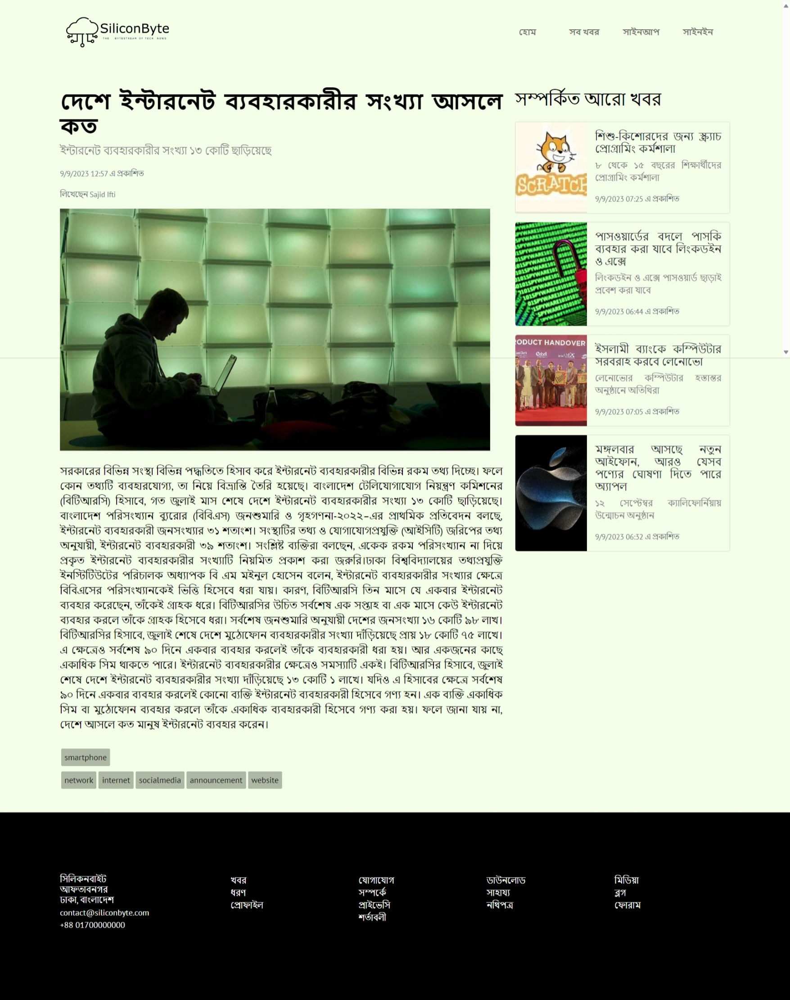
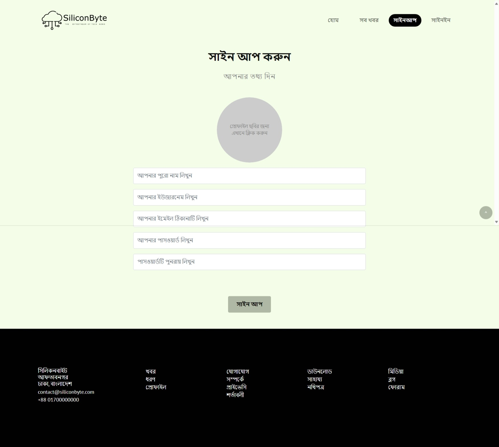
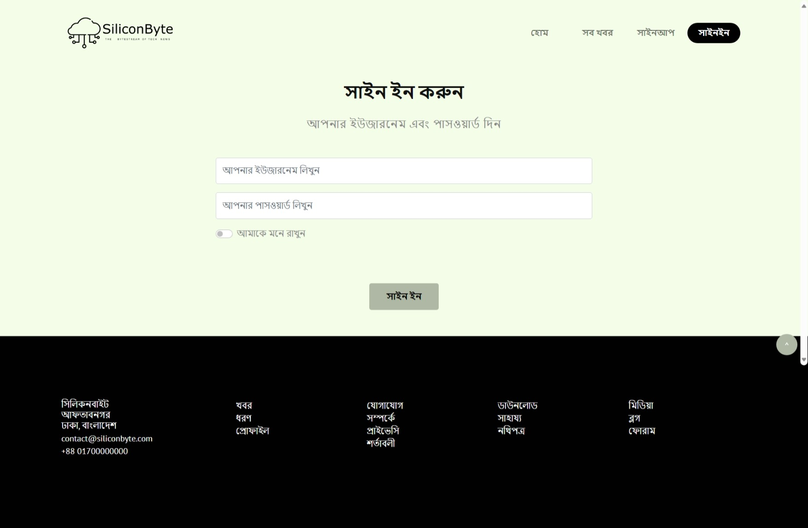
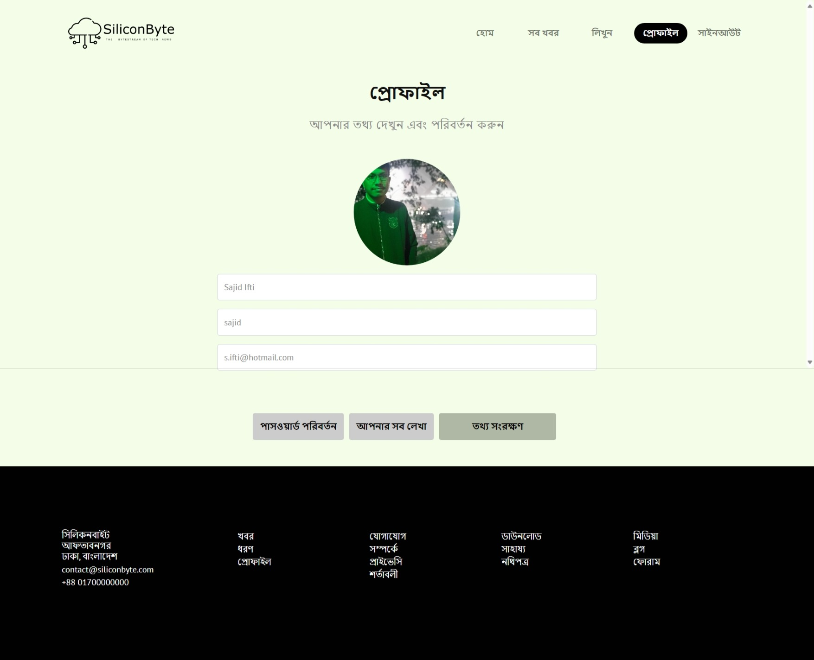
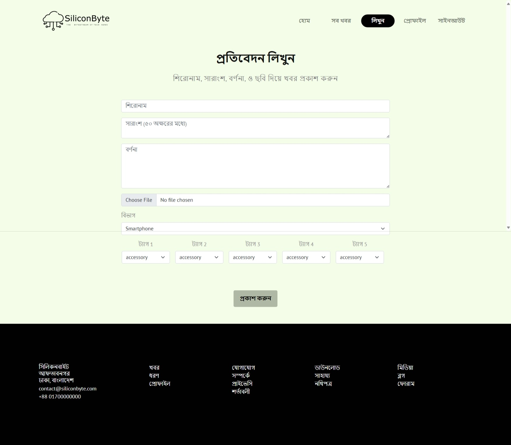

# SiliconByte - Tech News Site with Recommendation System

SiliconByte is a tech news website built using PHP, designed to provide the latest technology news and recommendations in the Bengali language (Bangla).

Please Visit: <a href="https://siliconbyte.sajidifti.com" target="_blank">https://siliconbyte.sajidifti.com</a>

## Features

### 1. Tech News

SiliconByte provides up-to-date technology news articles in the Bengali language. Users can read about the latest developments, product releases, and industry trends.

### 2. Recommendation System

The site includes a recommendation system that suggests articles to users based on their interests and reading history. This feature enhances the user experience by offering personalized content. If a user is not logged in, the recommendation system will be turned off and display the most viewed and least viewed articles instead.

### 3. User Accounts

Users can create accounts, log in, and manage their profiles. The recommendation system utilizes user data to make relevant content suggestions. Writers can write and manage articles. All users can edit their profiles.

### 4. Admin Panel

The website includes an admin panel for managing user activity logs, visiting user IP address and count, and site settings.

## Requirements

To run SiliconByte on your local development environment or a web server, you'll need the following:

### 1. PHP

Ensure that you have PHP installed on your server or local machine. You can download PHP from the official website if it's not already installed.

### 2. Web Server

You can use a web server like Apache or Nginx to host SiliconByte. Make sure the web server is properly configured.

### 3. Database

SiliconByte uses a MySQL/MariaDB database to store articles, user data, and recommendations. Run the siliconbyte.sql file to populate the database.

### 4. Local Development Server

You can also use XAMPP to run the project.

## Usage

### 1. Clone This Repo

```bash
git clone https://github.com/sajidifti/Siliconbyte_Bangla_Tech_News_Site_PHP
```

### 2. Start Web Server and Visit SiliconByte

If you are using Xampp, place the project folder inside htdocs. Then visit localhost/[project_folder_name].

## License

SiliconByte is open-source software released under the MIT License. See the LICENSE file for details.

## Contact

For any questions or feedback, please contact me:

Sajid Anam Ifti <info@sajidifti.com>

## Site Screenshots

### 1. Home

<div align="center">
    
</div>

### 2. All Articles

<div align="center">
    
</div>

### 3. Article Details

<div align="center">
    
</div>

### 4. Sign Up

<div align="center">
    
</div>

### 5. Sign In

<div align="center">
    
</div>

### 6. Profile

<div align="center">
    
</div>

### 7. Write An Article

<div align="center">
    
</div>
